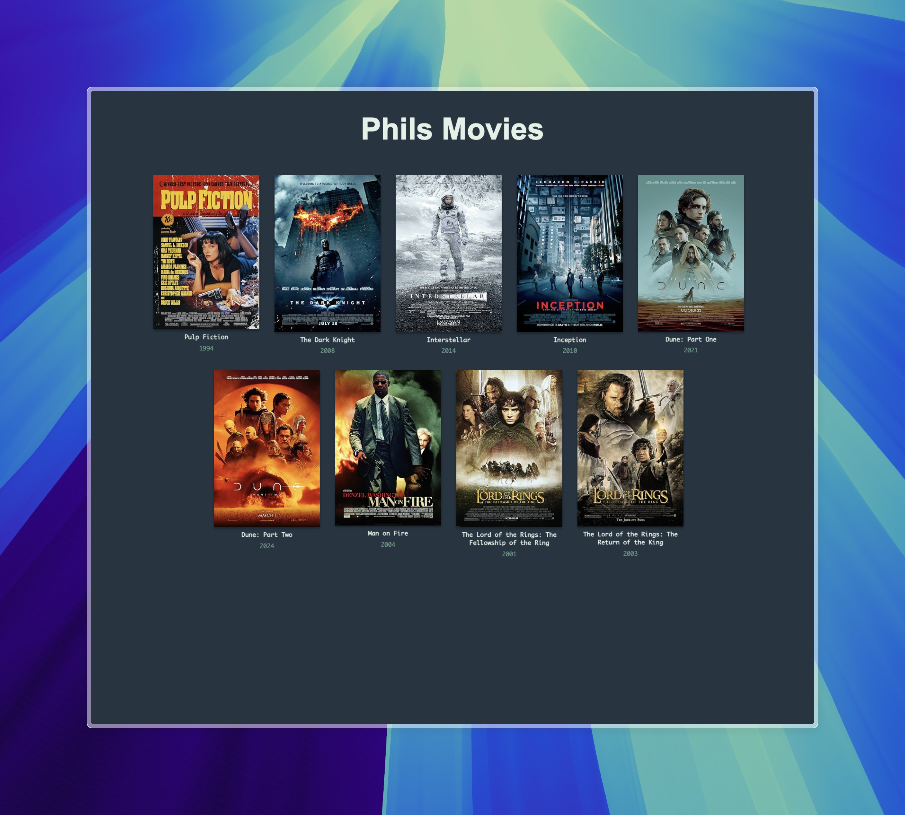

# My Movies Database

A simple movie management application that allows users to manage their movie collection.

```
Menu:

0. Exit
1. List movies
2. Add movie
3. Delete movie
4. Stats
5. Random movie
6. Search movie
7. Movies sorted by rating
8. Movies sorted by year
9. Filter movies
10. Generate website

Enter choice (0-10): 1

9 movies in total
Pulp Fiction (1994): 8.9
The Dark Knight (2008): 9.0
Interstellar (2014): 8.7
Inception (2010): 8.8
Dune: Part One (2021): 8.0
Dune: Part Two (2024): 8.5
Man on Fire (2004): 7.7
The Lord of the Rings: The Fellowship of the Ring (2001): 8.9
The Lord of the Rings: The Return of the King (2003): 9.0

Press enter to continue
```

<p style="margin: -1.8rem 0 2rem 2rem; font-size: 0.5rem">CLI-Interface</p>



<p style="text-align:center;margin-top: -1.5rem; font-size: 0.5rem">Generated Website</p>

## Features

- Add/Delete Movies: Easily add new movies or remove existing ones.
- Search and Filter: Search for movies and filter them by title, year, or rating.
- View Statistics: Get insights like average and median ratings, as well as the best and worst movies.
- Random Movie Suggestion: Get a random movie suggestion for your viewing pleasure.
- Generate HTML Website: Create a website showcasing your movie collection.

## Usage

1. install packages from requirements.txt

- `pip install -r requirements.txt`

2. create free account for [OMDB API](https://www.omdbapi.com/) api key

3. create .env file in root folder and save your key in it

- `API_KEY=yourKey`

4. run app

- `python app/main.py`
